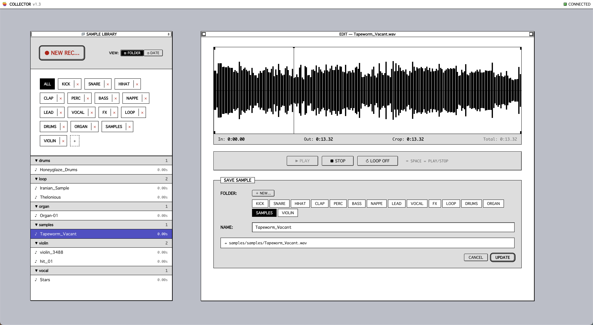

# SAMPLER_COLLECTOR

A retro-inspired audio sample collection and editing application with a classic **Mac OS 7 UI**. Record audio from browser tabs, organize samples into custom folders, and edit them with precision waveform controls.

---

## Features

🎙️ **Record from Browser Tabs**
- Capture audio directly from Chrome/Chromium tabs
- Real-time frequency analyzer visualization
- Clean WebM format with FFmpeg processing

📁 **Organized Library**
- Create and manage custom sample folders
- Browse by folder or date
- View sample duration and metadata

🎛️ **Waveform Editor**
- Visual waveform with in/out point controls
- Precise sample trimming
- Play/stop with loop support
- Real-time playback of selected region

💾 **Save & Update**
- Save trimmed samples with custom names
- Update existing samples
- Auto-organized folder structure

🎨 **Retro UI**
- Authentic Mac OS 7 styling
- Pixel-perfect fonts with antialiasing
- Classic window chrome and buttons
- All-caps typography for that nostalgic feel

---

## Screenshots



*Sample Library on the left, Waveform Editor on the right with full editing controls*

---

## Requirements

- **Node.js** (v18+) → [nodejs.org](https://nodejs.org)
- **FFmpeg** → `brew install ffmpeg` (macOS) or `apt install ffmpeg` (Linux)
- **Chrome/Chromium** browser (for tab audio capture)

---

## Installation

```bash
# Clone the repository
git clone https://github.com/stevanparisian/SAMPLER_COLLECTOR.git
cd SAMPLER_COLLECTOR

# Install frontend dependencies
npm install

# Install backend dependencies
cd server && npm install && cd ..
```

---

## Usage

**Terminal 1 — Start the backend:**
```bash
cd server
npm start
```

You should see:
```
✅ Server running on http://localhost:3001
✅ FFmpeg available
```

**Terminal 2 — Start the frontend:**
```bash
npm run dev
```

Open **http://localhost:5173** in your browser.

---

## How to Use

### Recording
1. Click **● NEW REC…** button
2. Select "Share tab audio" from Chrome's popup
3. Choose the tab you want to record from
4. Click **■ STOP & EDIT** when done

### Organizing
1. Create folders by clicking the **＋** button
2. View samples by folder or date using the **VIEW** buttons
3. Click any sample to load it into the editor

### Editing
1. Adjust **in** and **out** points on the waveform
2. Preview with **▶ PLAY** / **■ STOP**
3. Use **↻ LOOP** for continuous playback
4. Enter a name for your sample
5. Click **SAVE** to store it or **UPDATE** to replace an existing one

---

## Project Structure

```
SAMPLER_COLLECTOR/
├── index.html              # HTML entry point
├── package.json            # Frontend dependencies
├── vite.config.ts          # Vite configuration
├── tsconfig.json           # TypeScript config
├── src/
│   ├── App.tsx             # Main React application
│   ├── index.css           # Styling (retro UI)
│   ├── main.tsx            # React entry point
│   └── vite-env.d.ts       # Vite types
├── server/
│   ├── src/index.ts        # Backend (Express.js)
│   ├── package.json        # Backend dependencies
│   └── samples/            # Stored audio files
├── setup.sh                # Initial setup script
└── start.sh                # Quick start script
```

---

## Tech Stack

- **Frontend** : React, TypeScript, Vite, Web Audio API
- **Backend** : Express.js, TypeScript, FFmpeg
- **Audio** : WAV format, 44.1kHz sample rate
- **Styling** : CSS with Mac OS 7 aesthetic

---

## Keyboard Shortcuts

- **Space** : Play/Stop (in Edit mode)

---

## Troubleshooting

| Issue | Solution |
|-------|----------|
| Backend won't start | Check FFmpeg: `ffmpeg -version` |
| No audio capture | Use Chrome/Chromium and enable "Share tab audio" |
| Server port already in use | Change port in `server/src/index.ts` |
| CORS errors | Ensure both frontend and backend are running |

---

## License

MIT

---

*Built with retro aesthetic and modern web standards.*
