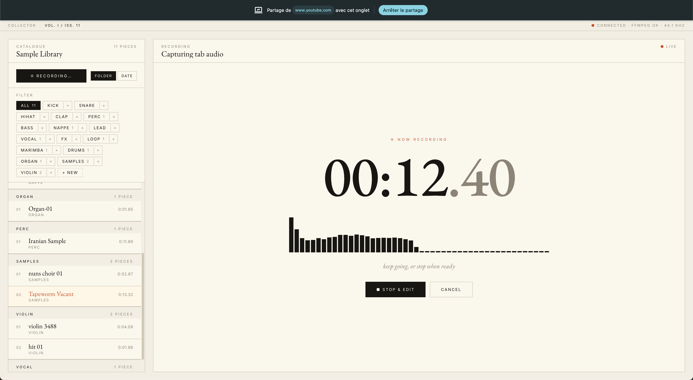

# SAMPLER_COLLECTOR

A retro-inspired audio sample collection and editing application with a classic **Mac OS 7 UI** inspiration. **Record audio directly from any browser tab** — capture YouTube videos, streaming audio, or any online content — then organize, edit, and trim samples with precision waveform controls.

---

## Features

🎙️ **Record Audio Directly from Browser Tabs**
- **Capture any online audio** — YouTube videos, streaming content, podcasts, etc.
- Record directly from any Chrome/Chromium tab without downloads
- Real-time frequency analyzer visualization during recording
- Auto-converts to WAV format with FFmpeg

📁 **Organized Library**
- Create and manage custom sample folders
- Browse by folder or date
- View sample duration and metadata

🎛️ **Waveform Editor**
- Visual waveform with in/out point controls
- Precise sample trimming
- Play/stop with loop support
- Real-time playback of selected region

💾 **Save & Update**
- Save trimmed samples with custom names
- Update existing samples
- Auto-organized folder structure

🎨 **Retro UI**
- Mac OS 7 inspiration styling
- Pixel-perfect fonts with antialiasing
- Classic window chrome and buttons
- All-caps typography for that nostalgic feel

---

## Screenshots


*Sample Library on the left, Waveform Editor on the right with editing controls*



*Recording view with real-time frequency analyzer*

---

## Requirements

- **Node.js** (v18+) → [nodejs.org](https://nodejs.org)
- **FFmpeg** → `brew install ffmpeg` (macOS) or `apt install ffmpeg` (Linux)
- **Chrome/Chromium** browser (for tab audio capture)

---

## Installation

```bash
# Clone the repository
git clone https://github.com/stevanparisian/SAMPLER_COLLECTOR.git
cd SAMPLER_COLLECTOR

# Install frontend dependencies
npm install

# Install backend dependencies
cd server && npm install && cd ..
```

Make sure **FFmpeg** is installed:
```bash
# macOS
brew install ffmpeg

# Linux
sudo apt install ffmpeg
```

---

## Usage

### Quick start (one command)

```bash
./start.sh
```

This launches both backend and frontend together. Press `Ctrl+C` to stop.

### Manual start (two terminals)

**Terminal 1 — Backend:**
```bash
cd server
npm start
```

You should see:
```
⚙️  COLLECTOR Backend on http://localhost:3001
📁 Samples: .../server/samples
✅ ffmpeg found
```

**Terminal 2 — Frontend:**
```bash
npm run dev
```

Open **http://localhost:5173** in Chrome/Chromium.

---

## How to Use

### Recording from a Browser Tab
1. Click **● NEW REC…** in the Sample Library
2. Chrome will prompt you to choose what to share — pick the tab with the audio
3. **Important:** check the **"Share tab audio"** box
4. Click **Share** — recording starts immediately
5. Click **■ STOP & EDIT** when done — the sample loads into the editor

### Organizing Samples
- Click **+** next to the folders to create a new category (a styled prompt appears)
- Click any folder chip to filter the library
- Use **⊞ FOLDER** or **◷ DATE** to switch grouping
- Click the red **×** to delete a folder (click twice to confirm)

### Editing a Sample
1. **Trim** — drag the handles on the waveform to set in/out points
2. **Preview** — click **▶ PLAY** or hit **Space**
3. **Loop** — click **↻ LOOP** for continuous playback (live updates while you slide)
4. **Undo / Redo** — use **↺ UNDO** / **↻ REDO** to revert trim or update operations
5. **Pick a folder** in the SAVE SAMPLE panel
6. **Name** the sample — uppercase, lowercase, numbers, `_` and `-` are allowed
7. Click **SAVE** (new) or **UPDATE** (overwrite the loaded sample)

After save/update, the waveform reloads with the trimmed audio so you can keep editing.

---

## Project Structure

```
SAMPLER_COLLECTOR/
├── index.html              # HTML entry point
├── package.json            # Frontend dependencies
├── vite.config.ts          # Vite configuration
├── tsconfig.json           # TypeScript config
├── src/
│   ├── App.tsx             # Main React application
│   ├── index.css           # Styling (retro UI)
│   ├── main.tsx            # React entry point
│   └── vite-env.d.ts       # Vite types
├── server/
│   ├── src/index.ts        # Backend (Express.js)
│   ├── package.json        # Backend dependencies
│   └── samples/            # Stored audio files
├── setup.sh                # Initial setup script
└── start.sh                # Quick start script
```

---

## Tech Stack

- **Frontend** : React, TypeScript, Vite, Web Audio API
- **Backend** : Express.js, TypeScript, FFmpeg
- **Audio** : WAV format, 44.1kHz sample rate
- **Styling** : CSS with Mac OS 7 aesthetic

---

## Keyboard Shortcuts

- **Space** : Play / Stop (in Edit mode)
- **Enter** : Confirm in folder name prompt
- **Escape** : Cancel folder name prompt

---

## Troubleshooting

| Issue | Solution |
|-------|----------|
| Backend won't start | Check FFmpeg: `ffmpeg -version` |
| No audio capture | Use Chrome/Chromium and enable "Share tab audio" |
| Server port already in use | Change port in `server/src/index.ts` |
| CORS errors | Ensure both frontend and backend are running |

---

## License

MIT

---

*Built with retro aesthetic and modern web standards.*
